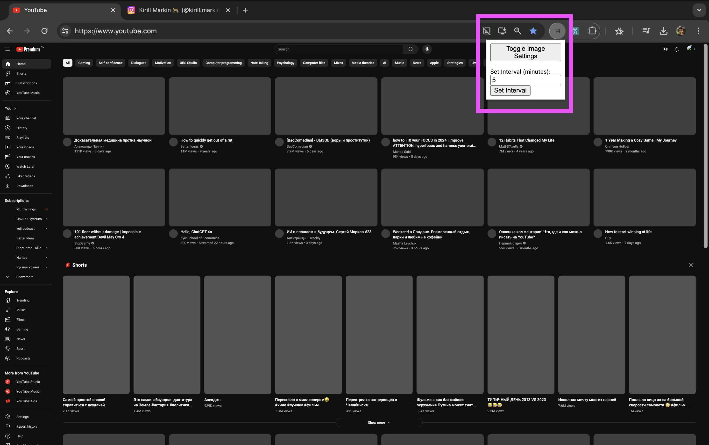
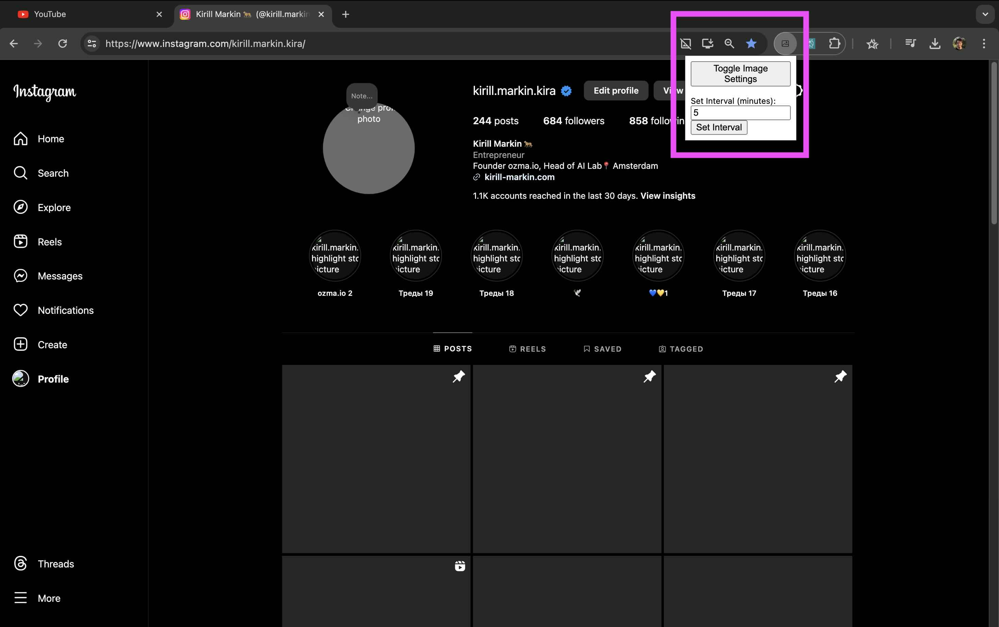

# Chrome Auto Image Blocker

Chrome Auto Image Blocker is a lightweight Chrome extension designed to improve your browsing experience by automatically blocking and toggling images on webpages based on a customizable schedule. Reduce distractions and speed up page load times with ease.

## Screenshots

|  |  |
|:---------------------------------------------:|:---------------------------------------------:|
| Screenshot 1                                  | Screenshot 2                                  |

## Features

- Auto-blocks images every 10 minutes by default.
- Manual toggle to enable or disable images instantly.
- Customizable interval for automatic image blocking.
- Almost no user interface 😁.
- Lightweight and efficient.

## Installation

1. Clone the repository:

   ```sh
   git clone https://github.com/kirill-markin/chrome-auto-image-blocker
   ```

2. Open Chrome and navigate to `chrome://extensions/`.

3. Enable "Developer mode" in the top right corner.

4. Click "Load unpacked" and select the directory where you cloned the repository.

## Usage

- Click the extension icon in the Chrome toolbar to open the popup.
- Use the "Toggle Image Settings" button to enable or disable images manually.
- Set your preferred interval for automatic image blocking.

## How It Works

This extension automatically changes Chrome's image settings to block or allow images based on your chosen schedule. You can also toggle this setting manually at any time.

## Contributing

Contributions are welcome! Please open an issue or submit a pull request.

## License

This project is licensed under the MIT License. See the [LICENSE](LICENSE) file for details.

## Contact

If you have any questions, feel free to contact me at [markinkirill@gmail.com](mailto:markinkirill@gmail.com).

## Issues

If you encounter any issues or have feature requests, please report them in the [Issues](https://github.com/kirill-markin/chrome-auto-image-blocker/issues) section of the GitHub repository.
